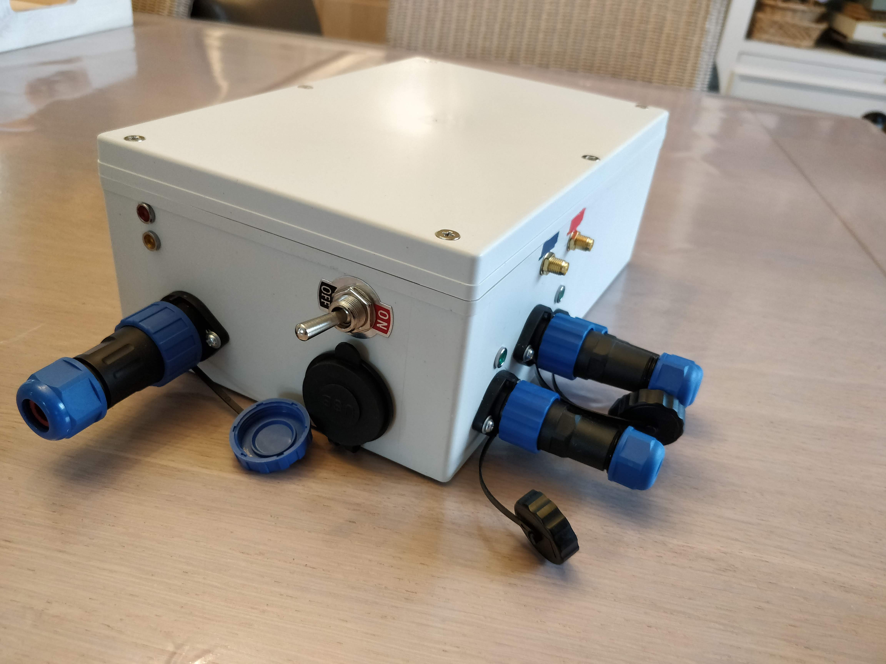

# SimpleSteer-hardware

## Tools
- B7000  glue: https://www.aliexpress.com/item/1005003653423730.html
- Heatshrink tube
- Pliers
- Blue and Red tape for marking the left and right antenna
- wire
- wire ferrules
- Electrical Wire Terminals: https://www.aliexpress.com/item/32813550981.html

## Parts
- Waterproof Enclosure 240x160x90: https://www.aliexpress.com/item/1005001890887248.html
- Waterproof inline fuse holder: https://www.aliexpress.com/item/32815891159.html
- Waterproof LED indicator lights: https://www.aliexpress.com/item/32808739651.html
    - 12V RED (Power indicator)
    - 12V GREEN (Steering indicator)
    - 5V Orange (SBC power indicator)
- Waterproof SP16 IP68 connector (steering 2PIN; angle sensor 3PIN): https://www.aliexpress.com/item/4000057901375.html
- Waterproof SP20-2F IP68 Connector (for main power): https://www.aliexpress.com/item/4001038548630.html
- 3-pin Power Connector (for main power): https://www.aliexpress.com/item/1005006172717862.html
- 2x Ardusimple simpleRTK2B:  https://www.ardusimple.com/product/simplertk2b/
- 2x u-blox GNSS Multiband antenna: https://www.ardusimple.com/product/ann-mb-00-ip67/
- Double BTS7960 H-bridge 43A: https://www.aliexpress.com/i/4000002701244.html
- Arduino Nano (328 No headers): https://www.aliexpress.com/item/1340812654.html
- SMA Male To SMA Female, 15cm: https://www.aliexpress.com/item/4000245307369.html
- 12V/24V USB charger (to power smartphone): https://www.aliexpress.com/item/1005005630704288.html
- E-TEN1021 ON/OFF Switch: https://www.aliexpress.com/item/32864133645.html
- 12V to 5V converter (to power SBC): https://www.aliexpress.com/item/1005007347664239.html
- 5m 4mmØ Braided cable sleeve blue: https://www.aliexpress.com/item/32827379784.html
- 5m 4mmØ Braided cable sleeve red: https://www.aliexpress.com/item/32824361527.html
- AA-ROT-120 sensor
## 3D print models
I recommend printing in PETG because PLA could become weak when the tractor cabin gets hot from the sun.
- [simpleRTK2B case](https://cad.onshape.com/documents/1462f832841c4706ac87ddbb/w/64ea86a71f18d172a5a19b36/e/8c6e0eea0ad177bdd25b1dd9?renderMode=0&uiState=66c9dbd2cae3851e3285f41c)
- [H-bridge + Arduino Nano case](https://cad.onshape.com/documents/1d4c39f33f5e81c853d12b12/w/6c4abd4b7e31bb9e0e3ae571/e/211b35d816884b6e6e3b05e2?renderMode=0&uiState=66c9dc0a9c88a80726002817)

## Assembly result pictures

