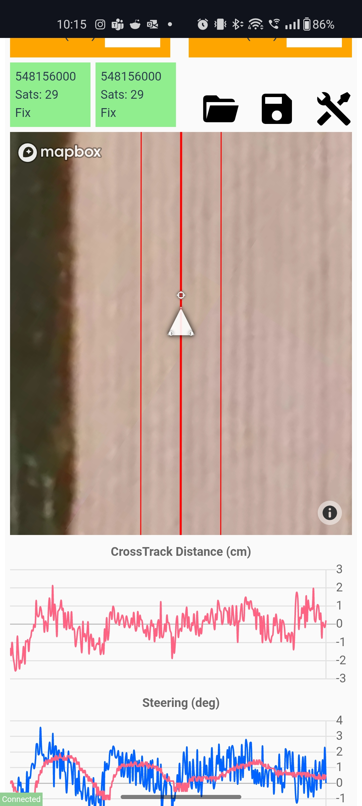

# SimpleSteer-frontend
## Images




## Getting started

1) Replace "REPLACE_WITH_MAPBOX_ACCESSTOKEN" with your mapbox accesstoken.
2) Use node version 10.24.1

### Project setup
```
npm install
```

### Compiles and hot-reloads for development
```
npm run serve
```

### Compiles and minifies for production
```
npm run build
```

### Customize configuration
See [Configuration Reference](https://cli.vuejs.org/config/).
